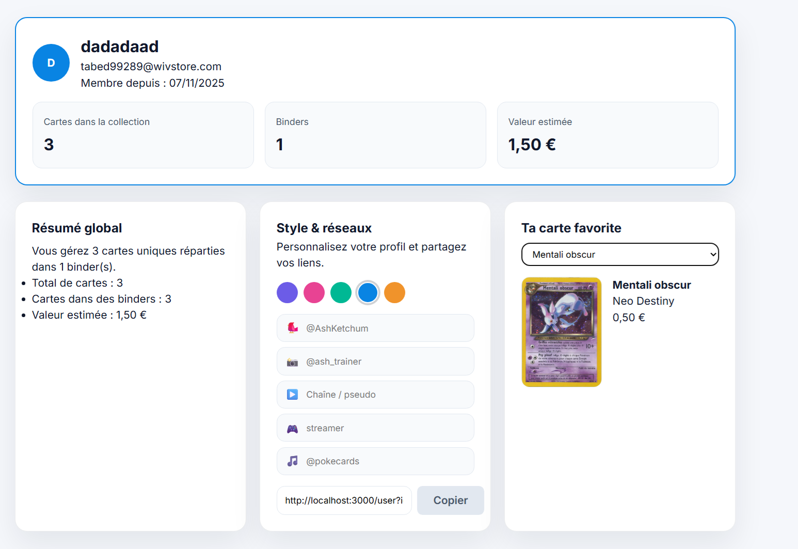
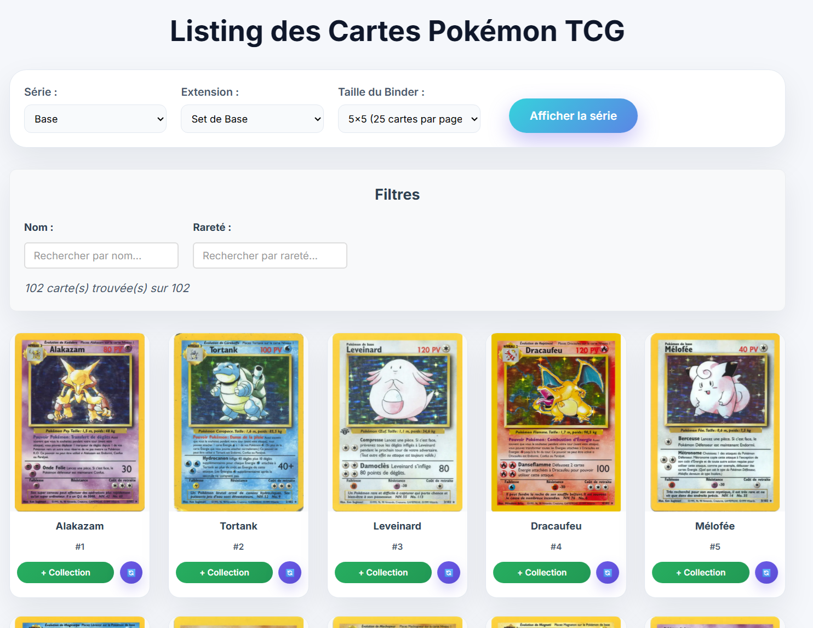
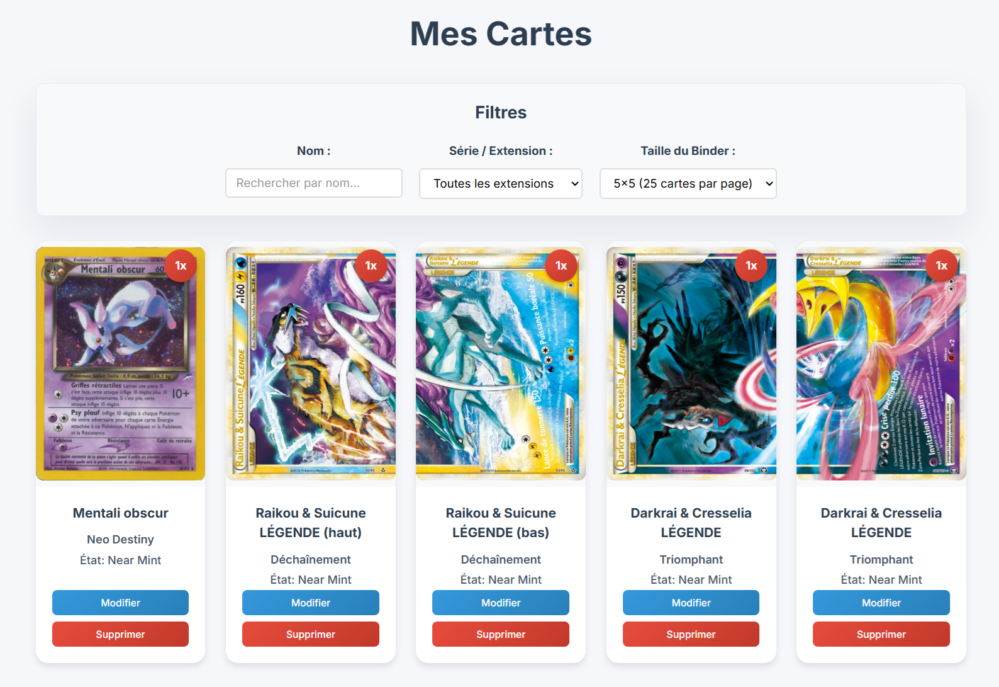
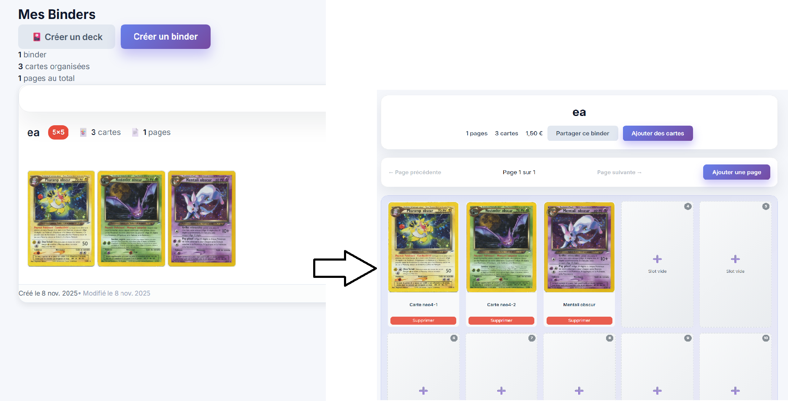
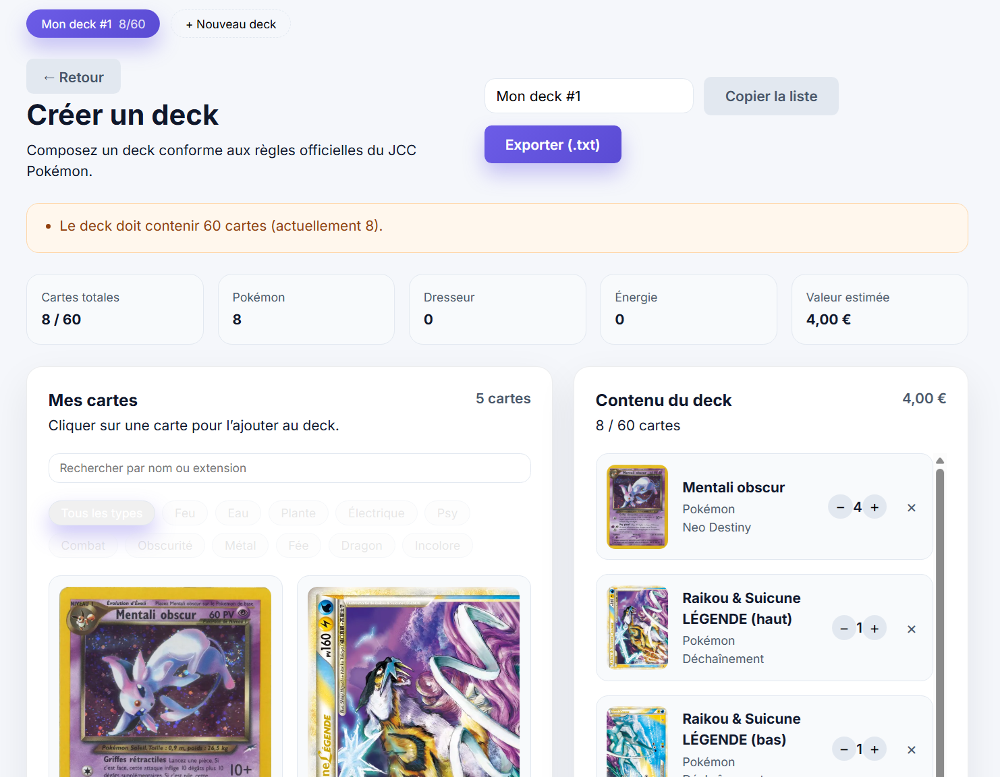

# 🃏 Pokémon TCG Binder

Application web pour gérer sa collection de cartes Pokémon TCG avec système de classeurs virtuels.

## Visuels


<!-- Les images référencées sont stockées dans `frontend/public/img/` -->











Ces images montrent l'interface utilisateur : gestion des binders, création de decks, affichage des cartes et page de profil.

## Teechnologies

- **Frontend**: React 18
- **Backend**: FastAPI + Uvicorn
- **Base de données**: MongoDB
- **Containerisation**: Docker + Docker Compose
- **Outils**: ESLint, Prettier, Tests unitaires

## 📦 Lancement

### Démarrage rapide

1. **Cloner le projet**
```bash
git clone https://github.com/BastienLopez/Pokemon_binder.git
cd Pokemon_binder
```

2. **Lancer avec Docker**
```bash
cd docker
docker-compose up --build
```

3. **Accéder à l'application**
- 🌐 **Frontend**: http://localhost:3000
- 🔧 **API Backend**: http://localhost:8000
- 📚 **Documentation API**: http://localhost:8000/docs
- 🗄️ **MongoDB**: localhost:27017

## 🏗️ Structure du projet

```
Pokemon_binder/
├── frontend/          # Application React
│   ├── public/
│   ├── src/
│   │   ├── components/
│   │   ├── pages/
│   │   └── services/
│   └── package.json
├── backend/           # API FastAPI
│   ├── routers/
│   ├── tests/
│   ├── main.py
│   └── requirements.txt
├── docker/            # Configuration Docker
│   ├── Dockerfile.frontend
│   ├── Dockerfile.backend
│   └── docker-compose.yml
├── start.bat          # Script Windows
├── start.sh           # Script Linux/Mac
└── ROADMAP.md         # Plan de développement
```

## 📦 Fonctionnalités principales
- 🔍 **Recherche de cartes Pokémon TCG** (via base officielle)
- 🧾 **Mes cartes** : Ajout, modification, suppression des cartes que vous possédez
- 📘 **Mes binders** : Créez des classeurs personnalisés 3x3 ou 4x4 pour organiser vos cartes
- 🎴 **Affichage visuel** en grilles interactives (zoom, lien Cardmarket, prix, artiste…)
- 🔁 **Filtres avancés** : par nom, par prix ou organisation manuelle
- 📊 **Statistiques de collection** et **wishlist**
- 🌍 **Partage public** de binders et export de collection

---

## ⚙️ Technologies utilisées
### Frontend
- HTML, CSS, JavaScript
- ⚛️ [React.js](https://react.dev/) (UI dynamique)
- [React Router](https://reactrouter.com/) (navigation)
- [Axios](https://axios-http.com/) (requêtes HTTP)

### Backend
- 🐍 Python
- [FastAPI](https://fastapi.tiangolo.com/) ou [Flask](https://flask.palletsprojects.com/)
- [PyMongo](https://pymongo.readthedocs.io/) (connexion MongoDB)
- [MongoDB Atlas](https://www.mongodb.com/cloud/atlas)

### Tests
- ✅ [Pytest](https://docs.pytest.org/)
- ✅ [Jest](https://jestjs.io/) (tests React)
- 🧪 GitHub Actions (CI/CD)
